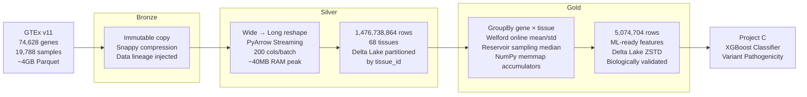

# Bio-AI Lakehouse
 
**End-to-end genomic data pipeline processing 1.47 billion rows on constrained hardware.**
 
A production-grade Medallion Architecture (Bronze → Silver → Gold) built on GTEx v11 gene expression data, designed to generate ML-ready features for variant pathogenicity classification.
 


 
---
 
## The Problem
 
GTEx v11 ships as a wide Parquet matrix: **74,628 genes × 19,788 tissue samples** (~4GB compressed). Turning that into ML-ready aggregated features requires:
 
1. Reshaping wide → long: **1.47 billion rows**
2. Grouping by gene × tissue: **5.07 million aggregated features**
3. Doing all of this with **~2–3 GB of available RAM** (WSL2 + Docker + IDE running simultaneously)
Standard tools failed immediately. Spark caused OOM on the reshape due to the 19,788-column width. Pandas `melt` could not fit even a single chunk. This project required designing a custom streaming architecture from scratch.
 
---
 
## Architecture
 

 
---
 
## Key Engineering Decisions
 
### Why not Spark for the reshape?
 
The Bronze matrix has 19,788 columns. Spark's schema inference alone loaded the full column list into the JVM heap, causing OOM before processing a single row. The pivot was to **PyArrow Dataset API with column-chunked reads** — processing 200 columns at a time, keeping RAM under 40MB per batch.
 
### Why not tdigest for the Gold median?
 
Initial implementation used `tdigest` for approximate median. It failed with repeated float values common in GTEx (many genes have identical TPM=0.0 across samples), causing internal tree corruption and OOM when instantiated for 5M groups simultaneously. Replaced with **Reservoir Sampling (Vitter's Algorithm R)** — fixed memory per group regardless of input size, no external dependencies.
 
### Why NumPy memmap for Gold accumulators?
 
5 million Python objects (one `GroupAccumulator` per gene × tissue combination) consumed ~3GB of RAM just for the infrastructure — before processing a single row. Moved all accumulator state to **NumPy memmap arrays backed by SSD**, reducing in-memory footprint to ~200MB constant regardless of group count.
 
### Why Welford online algorithm for mean/std?
 
Computing mean and standard deviation over ~19,788 values per group requires either storing all values (RAM-prohibitive) or using an online algorithm. **Welford's method** updates mean and variance in a single pass with O(1) memory — no values stored, no two-pass computation.
 
### Why log1p applied at Gold, not Silver?
 
Silver preserves raw TPM values as the source of truth. `log1p` is a transformation for a specific consumer (ML model). Applying it in Silver would make Silver no longer raw — any future consumer expecting TPM values would receive transformed data silently. **Gold applies log1p** because Gold is consumer-specific by design.
 
### Why zeros preserved in Silver?
 
51.89% of TPM values are exactly 0.0. In genomics, a zero TPM means the gene was not detected in that sample — it is biologically meaningful information, not a measurement error. Zeros are preserved in Silver and tracked via `zero_fraction` in Gold.
 
---
 
## Pipeline Metrics
 
| Layer | Rows | Size | Duration | RAM Peak |
|-------|------|------|----------|----------|
| Bronze | 74,628 genes × 19,788 samples | ~4 GB | ~2 min | ~1 GB |
| Silver | 1,476,738,864 | ~25 GB (Delta) | 13.6 min | ~200 MB |
| Gold | 5,074,704 | — | 115 min | ~200 MB |
 
**Silver duration note:** 13.6 minutes for Phase 2 (Delta write). Phase 1 (PyArrow reshape + staging) runs separately.
 
---
 
## Quality Gates
 
Every layer has an explicit quality gate. The pipeline stops before writing the next layer if any critical check fails.
 
**Silver gate (6 checks):**
```
✅ nulls_gene_id        expected=0       actual=0
✅ nulls_sample_id      expected=0       actual=0
✅ nulls_tissue_id      expected=0       actual=0
✅ quarantine_threshold expected=<= 1%   actual=0.00%
✅ lineage_closure      expected=1,476,738,864  actual=1,476,738,864
✅ zero_fraction        expected=46.9%–56.9%    actual=52.52%
```
 
**Gold gate (7 checks):**
```
✅ nulls_gene_id               expected=0        actual=0
✅ nulls_gene_symbol           expected=0        actual=0
✅ nulls_tissue_id             expected=0        actual=0
✅ gold_row_count              expected=5,074,704 actual=5,074,704
✅ gold_tissue_count           expected=68        actual=68
✅ gold_min_sample_count       expected>=1        actual=2
✅ zero_fraction_consistency   expected=47.5%–57.5% actual=52.33%
```
 
---
 
## Biological Validation
 
Gold features were validated against known biological ground truth:
 
**GAPDH** (housekeeping gene — expressed in all tissues):
- `zero_fraction` across all 68 tissues: **0.0000**
- `mean_log1p_tpm` minimum across all tissues: **4.95**
- ✅ Confirms universal expression as expected
**INS** (insulin — tissue-specific to pancreas):
- `zero_fraction` in Pancreas: **0.000**
- `zero_fraction` in Pancreas - Islets of Langerhans: **0.000**
- `zero_fraction` in most non-pancreatic tissues: **> 0.5**
- ✅ Confirms tissue-specific expression as expected
---
 
## Gold Features (ML-Ready)
 
Each row represents one gene in one tissue:
 
| Column | Type | Description |
|--------|------|-------------|
| `gene_id` | STRING | Ensembl gene ID (e.g. ENSG00000111640) |
| `gene_symbol` | STRING | HGNC symbol (e.g. GAPDH) |
| `tissue_id` | STRING | GTEx tissue name (e.g. Pancreas) |
| `mean_log1p_tpm` | FLOAT32 | Mean log1p(TPM) across samples |
| `std_log1p_tpm` | FLOAT32 | Std dev log1p(TPM) — Welford online |
| `median_log1p_tpm` | FLOAT32 | Approximate median — Reservoir sampling |
| `sample_count` | INT32 | Number of samples contributing |
| `zero_fraction` | FLOAT32 | Fraction of samples with TPM == 0.0 |
 
---
 
## Project C — Variant Pathogenicity Classifier
 
Gold features are designed as input to an XGBoost classifier that predicts variant pathogenicity using tissue-specific gene expression context.
 
**ClinVar overlap verified:**
```
GTEx genes           : 73,321
ClinVar labeled genes: 19,608
Overlap              : 11,347 genes
Trainable variants   : 1,039,017
Sufficient for ML    : True
```
 
The classifier joins Gold features with ClinVar variant annotations, adding tissue-level expression context to standard pathogenicity features. SHAP values will identify which tissues drive each prediction.
 
---
 
## Repository Structure
 
```
src/
  jobs/
    bronze_ingest.py          # Immutable raw ingestion
    silver_phase1_reshape.py  # Wide→long PyArrow streaming
    silver_phase2_delta.py    # Delta Lake write with quality gate
    silver_tuner.py           # Binary search RAM tuner (synthetic data)
    gold_transform.py         # Aggregation + memmap accumulators
  utils/
    gold_accumulators.py      # Welford + Reservoir sampling state
    gold_batch_reader.py      # Silver batch iterator with dynamic sizing
    quality_checks.py         # Pure functions — Bronze/Silver/Gold gates
    lineage.py                # Data lineage JSON builders
    resources.py              # Elastic infrastructure profiling
    execution_profile.py      # SURVIVAL/BALANCED/PERFORMANCE/PRO profiles
    metadata_loader.py        # GTEx tissue mapping loader
data/
  bronze/gtex/                # Immutable raw Parquet
  silver/gtex/                # Delta Lake, partitioned by tissue_id
  gold/gtex/                  # Delta Lake ZSTD, partitioned by tissue_id
  lineage/                    # JSON lineage per layer + pipeline aggregate
```
 
---
 
## Stack
 
| Component | Version | Role |
|-----------|---------|------|
| Python | 3.8 | Runtime |
| PyArrow | 17 | Columnar I/O and reshape |
| delta-rs | 0.21.0 | Delta Lake writes (no JVM) |
| NumPy | — | Memmap accumulators |
| psutil | — | Dynamic RAM-based batch sizing |
| Docker | — | Containerized Spark master/worker |
| WSL2 | — | Host environment |
 
**Notably absent:** PySpark is used only for the Bronze ingestion cluster setup. All Silver and Gold processing runs on PyArrow + delta-rs with zero JVM dependency.
 
---
 
## Running the Pipeline
 
```bash
# Bronze
docker exec -it --workdir /opt/spark/work-dir spark-master \
  env PYTHONPATH=. python3 src/jobs/bronze_ingest.py
 
# Silver Phase 1 (reshape → staging)
docker exec -it --workdir /opt/spark/work-dir spark-master \
  env PYTHONPATH=. python3 src/jobs/silver_phase1_reshape.py
 
# Silver Phase 2 (staging → Delta Lake)
docker exec -it --workdir /opt/spark/work-dir spark-master \
  env PYTHONPATH=. python3 src/jobs/silver_phase2_delta.py
 
# Gold (aggregation → Delta Lake)
docker exec -it --workdir /opt/spark/work-dir spark-master \
  env PYTHONPATH=. python3 -u src/jobs/gold_transform.py 2>&1 | tee gold_transform.log
```
 
All steps are idempotent. Re-running any step is safe.
 
---
 
## Data Lineage
 
Every layer generates a JSON lineage record. After Gold completes:
 
```json
{
  "pipeline": "bio-ai-lakehouse",
  "dataset": "GTEx Gene Expression v11",
  "layers_complete": "3/3",
  "status": "complete"
}
```
 
Lineage tracks: source file hash, ingestion timestamp, row counts, quality gate results, duration, and infra fingerprint (SHA-256) per layer.
 
---
 
## Hardware Constraints
 
This pipeline was built and validated on:
- **RAM:** 16GB DDR4, ~2–3GB available during processing (WSL2 + Docker + VS Code)
- **Storage:** SSD (memmap accumulators rely on fast random I/O)
- **No GPU required** for Bronze/Silver/Gold — GPU used in Project C (XGBoost)
The elastic profiling system (`execution_profile.py`) detects available RAM at runtime and selects the appropriate execution profile automatically.